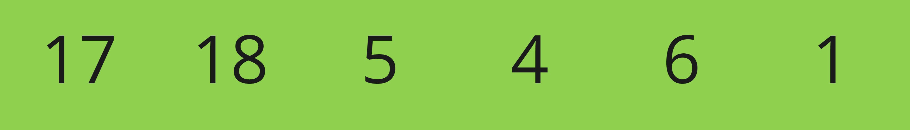
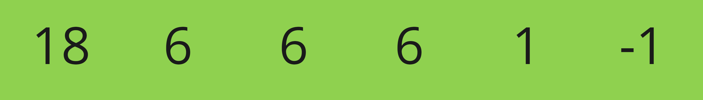

## ✏️ 2주차 회고록

추석이 지나고 여름이 끝나는줄 알았지만, 다시 날씨가 뜨거워졌다.

연휴가 지난후라 정신없는 일주일을 보내었다.

프로젝트 기획, 알고리즘 공부 및 학점 관리, 그리고 영어 공부와 교내 근로까지 정신없는 한 주가 되었다.

가장 바쁘고 정신없는 한 학기가 되겠지만, 할 수 있는 만큼 끝까지 최선을 다해보고자 한다.

---

## 1032. 명령 프롬프트 (Bronze I)

문자 비교와 구현이 주를 이루는 문제로, 입력된 문자열들의 각 위치에 모두 동일한 문자가 위치할 경우 출력을 해당 문자로, 아닐경우 ? 로 출력하도록 구현하는 문제이다.

> 입력
>
> <b>config</b>.sys
>
> <b>config</b>.inf
>
> <b>config</b>ures
>
> ---
>
> 출력
>
> <b>config</b>????

위와 같이 모든 문자열들간 중복되어지는 문자만 출력되도록 해야한다.

본 문제를 해결하기 위해 고민했던 두 가지 방법은 문자열을 먼저 비교할것이냐, 문자의 위치를 먼저 비교할것이냐 였다.

이후 문자의 위치를 먼저 비교하는것이 구현이 간단하다고 생각되었고, 해당 방법을 통해 구현하기로 결정하였다.

```python
result = list()

for i in range(charLength) :
  char = list(commands[0])[i]
  count = 1

  for j in range(1, len(commands)) :
    if char == list(commands[j])[i] :
      count += 1

  if count == N :
    result.append(char)

  else :
    result.append("?")

print("".join(result))
```

각 문자 위치를 먼저 결정하고, 첫번째 문자열의 문자를 기본으로 설정하였다.

이후 나머지 문자열들간의 비교를 통해 count 변수의 수를 변경해주었고, 그 값이 문자열의 갯수에 맞으면 결과에 해당 문자를, 아닐경우 ?를 저장해주었다.

이후 join 을 통해 문자열로 변환 후 출력해주었다.

---

## 1299. Replace Elements with Greatest Element on Right Side

배열을 다루는 문제로, 배열의 우측 끝부터 좌측으로 갈수록 큰 값이 되도록 구성하며, 가장 우측의 값은 -1 로 설정하며, 우측의 값보다 작은 값들은 우측에 위치한 가장 큰 값으로 대체되어진다.

> 

위의 배열이 주어진 경우, 아래의 배열로 변환되어야한다.

> 

본 문제를 두가지 방법으로 해결해보았지만, 한가지 방법은 시간 초과가 되었고, 다른 하나의 방법은 통과하였다.

먼저 시간 초과의 풀이를 소개하고자 한다.

### 1번째 풀이

```python
for i in range(len(arr)) :
  maxNum = -1

  for j in range(i + 1, len(arr)) :
    if maxNum < arr[j] :
      maxNum = arr[j]
  arr[i] = maxNum
```

좌측에서부터, 우측으로 접근하여 현재 위치의 우측에 위치한 값을 최대값으로 설정하고, 이후 모든 우측의 값들을 비교하여 최대값을 설정한다.

이후 현재 위치의 값을 최대 값으로 설정한다.

본 풀이 방법은 2중 반복문을 통해 인덱싱 하므로, O(n<sup>2</sup>)의 실행복잡도를 갖는다.

따라서 시간 초과가 발생하였다.

### 2번째 풀이

```python
maxNum = -1

for i in range(len(arr) - 1, -1, -1) :
  cur = arr[i]
  arr[i] = maxNum
  if maxNum < cur :
      maxNum = cur
```

첫번째 풀이와 다르게 단 하나의 반복문만을 사용하기 때문에 O(n)의 실행복잡도를 갖게 되어 시간 초과가 발생하지 않는다.

본 풀이 방법은 우측 끝부터 좌측 끝까지 이동하며, 전의 위치에 제공되어진 최대값을 현재 위치에 넣게된다.

이후 현재 값이 더 큰 경우, 다음 위치에서 사용할 최대값을 현재 값으로 지정하고, 다음 위치로 이동한다.
